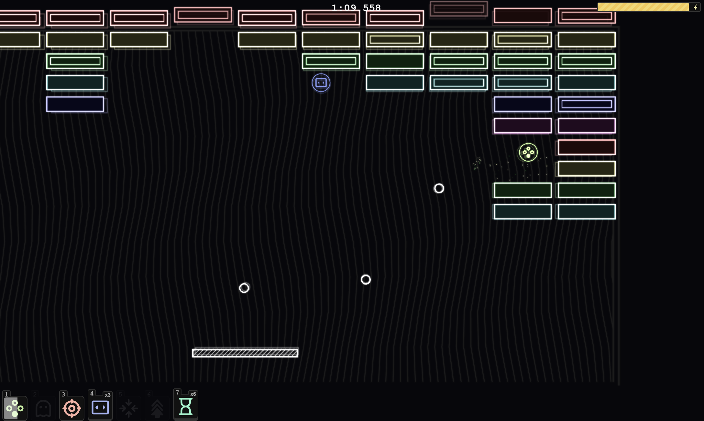
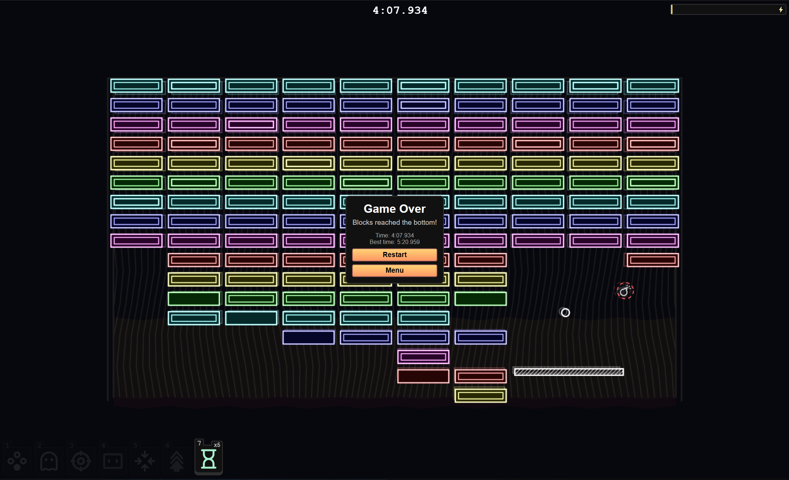

# Reverse Breakout

A twist on the classic Breakout game where you control the balls instead of the paddle. Keep the ball in play while preventing dropping blocks from reaching the bottom of the screen; stay alive for as long as you can!




## Setup

Install the dependencies:

```bash
pnpm install
```

## Get started

```bash
pnpm run dev
```

Build the app for production:

```bash
pnpm run build
```